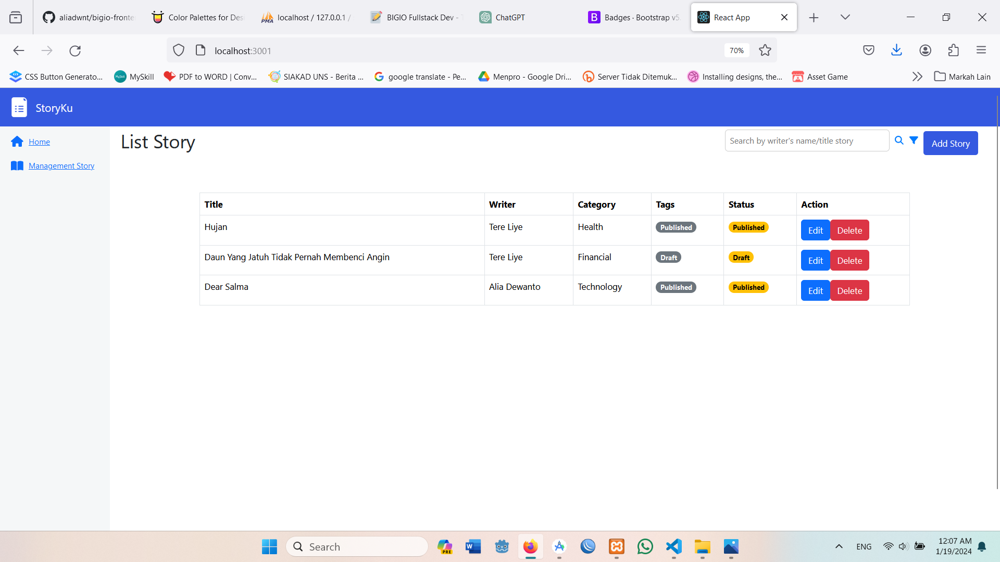
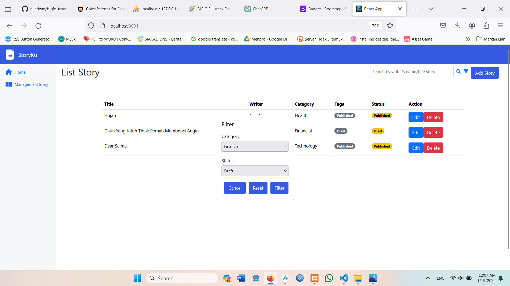
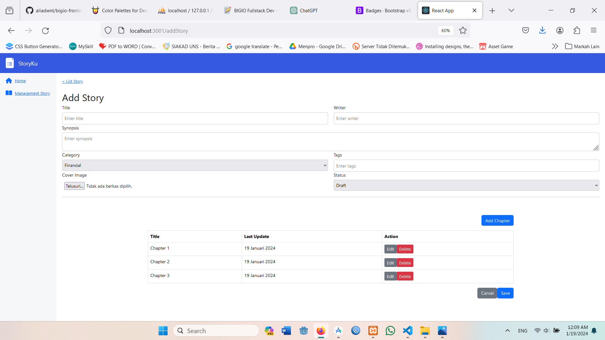
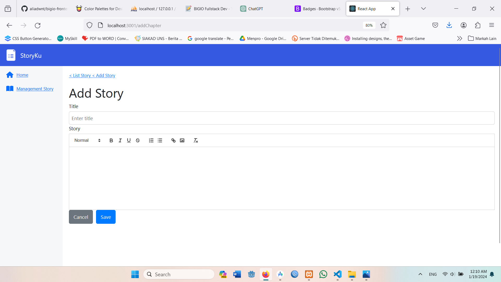
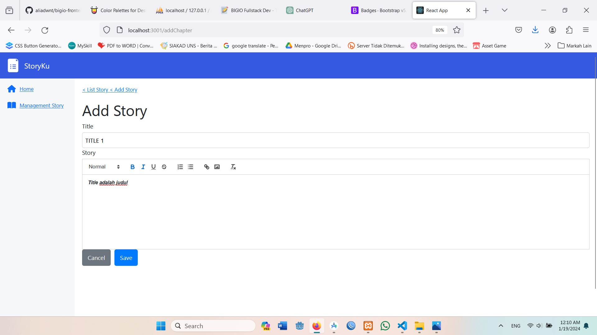
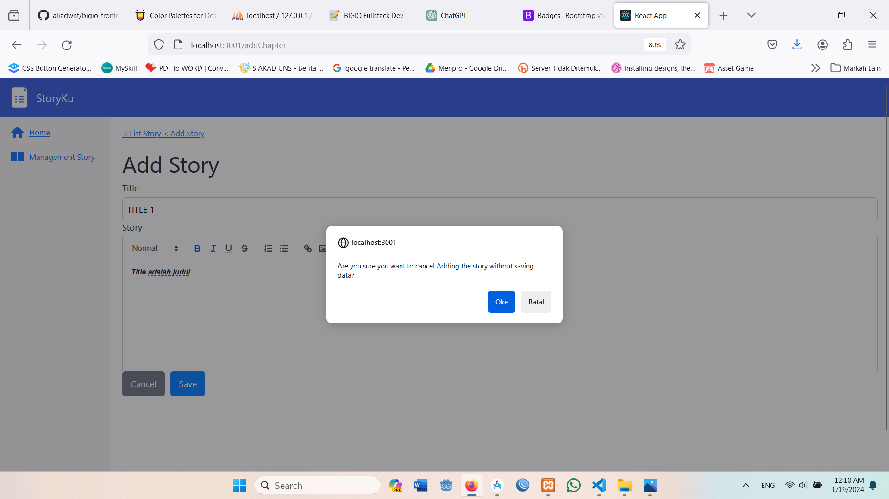

# StoryKu

## Table of Contents
client                                                                           
├─ node_modules                                                      
├─ public                                                                        
│  ├─ favicon.ico                                                                
│  ├─ index.html                                                                 
│  ├─ logo192.png                                                                
│  ├─ logo512.png                                                                
│  ├─ manifest.json                                                              
│  └─ robots.txt                                                                 
├─ src                                                                           
│  ├─ assets                                                                     
│  │  └─ images                                                                  
│  │     └─ logo.png                                                             
│  ├─ components                                                                 
│  │  ├─ addChapterForm.jsx                                                      
│  │  ├─ ChapterTable.jsx                                                        
│  │  ├─ header.jsx                                                              
│  │  ├─ headerStoryList.jsx                                                     
│  │  ├─ navbar.jsx                                                              
│  │  ├─ sidebar.jsx                                                             
│  │  ├─ StoryListForm.jsx                                                       
│  │  └─ StoryListTable.jsx                                                      
│  ├─ document                                                                   
│  │  └─ StoryList.png                                                           
│  ├─ pages                                                                      
│  │  ├─ addChapter.jsx                                                          
│  │  ├─ addStory.jsx                                                            
│  │  └─ listStory.jsx                                                           
│  ├─ App.css                                                                    
│  ├─ App.js                                                                     
│  ├─ App.test.js                                                                
│  ├─ index.css                                                                  
│  ├─ index.js                                                                   
│  ├─ logo.svg                                                                   
│  ├─ reportWebVitals.js                                                         
│  └─ setupTests.js                                                              
├─ package-lock.json                                                             
├─ package.json                                                                  
└─ README.md                                                                     

##  Features:
The following features have been implemented:
- **Story List**

- **Add Story**

- **Story Detail**

- **Edit Story**

##  Libraries:
This project uses the following libraries:

- **ReactJS**

  ## DOCUMENTATION
  **1. Story List**

  **2. Search by name or author with Implement a filter using a popup modal that displays categories and status.**

  **3. Story and Chapter List**

  **4. Add Chapter**

  **5. Add Chapter with edit text feature**

  **6. Cancel Button (if button clicked, there is a notification modal: 'Are you sure you want to cancel adding the story without saving the data?’')**

- **CodeIgniter4**
Note : Mohon maaf, saya belum selesai membuat back-endnya.. dikarenakan saya baru membaca email tanggal 18 Jan 2024 Pukul 19.45, dan deadline tanggal 19 Jan 2024 Pukul 05.00, sehingga saya tidak bisa menyelesaikan tugas dengan maksimal
Repository Back-End : https://github.com/aliadwnt/bigio-backend.git 
