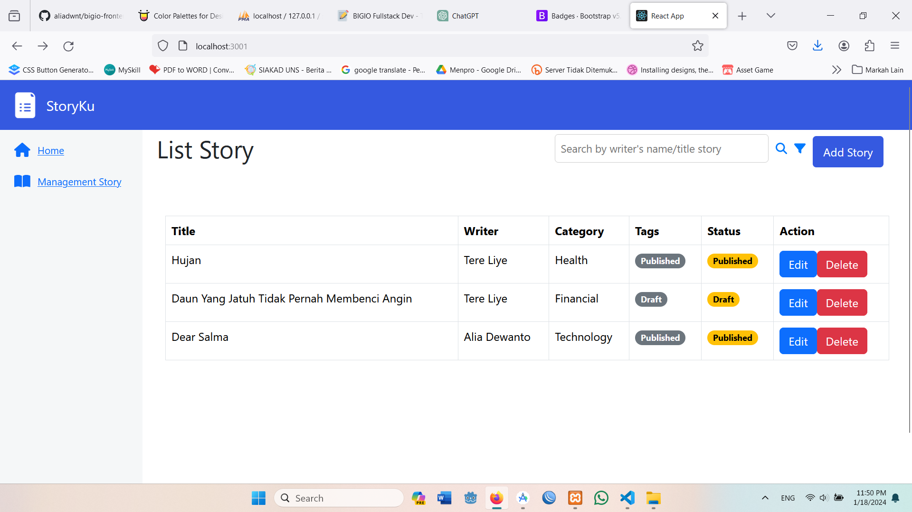

# StoryKu

## Table of Contents
├── client
│ ├── public
│ ├── src
│ │ ├── assets
│ │ ├── components
│ │ ├── pages
│ ├── README.md

##  Features:
The following features have been implemented:
- **Story List**

- **Add Story**

- **Story Detail**

- **Edit Story**

##  Libraries:
This project uses the following libraries:

- **ReactJS**

  ## DOCUMENTATION

- **CodeIgniter4**
  [Link to CodeIgniter4 documentation or relevant information.]

